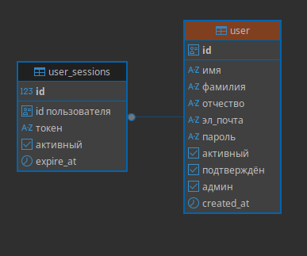
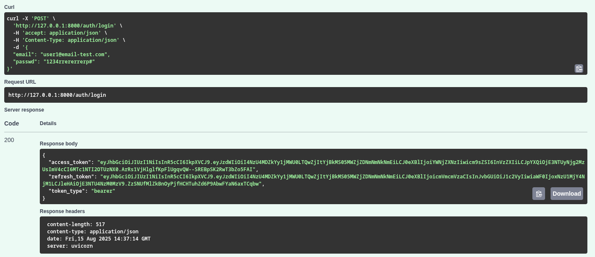
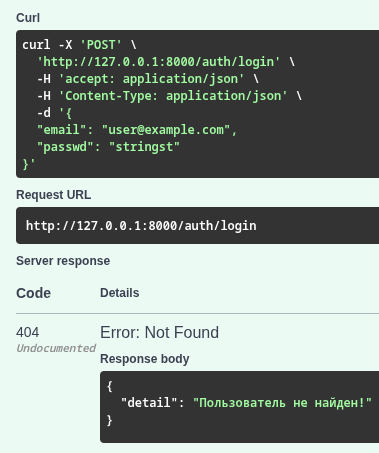
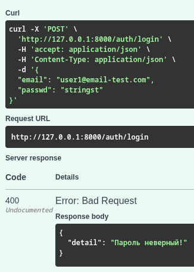
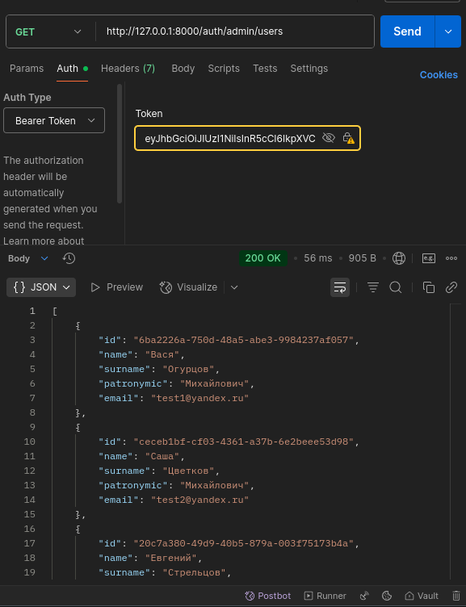
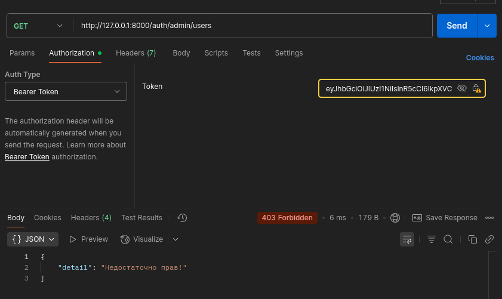
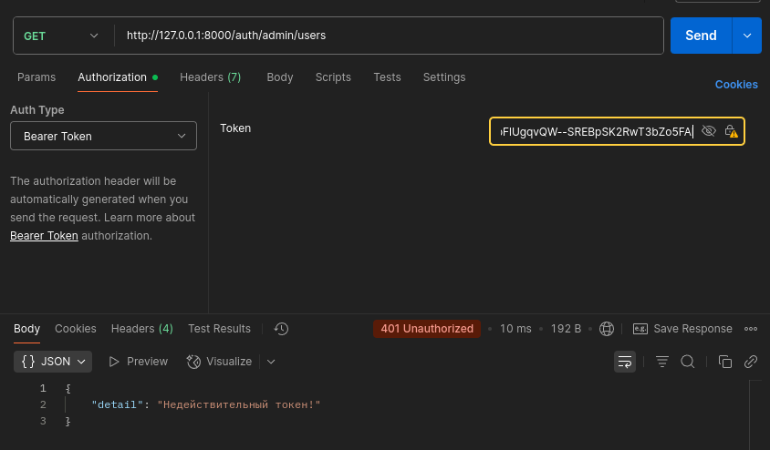
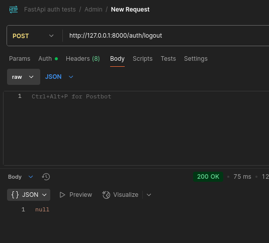
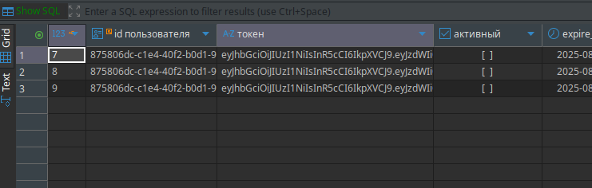
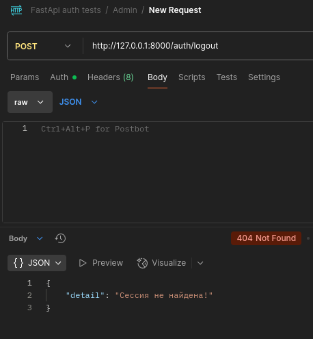

# Fast Auth Backend

**Fast Auth Backend** — это бекенд-приложение для аутентификации и авторизации пользователей в системе.

## Стек

- **PostgreSQL** — база данных  
- **Docker** — контейнер для базы данных (для удобства)  
- **Alembic** — управление миграциями базы данных  
- **SQLAlchemy** — ORM  
- **Ruff** — автоматическое форматирование кода (используется для автоматически сгенерированных миграций)  
- **Passlib bcrypt** — хеширование паролей  
- **Email-validator** — валидация email-поля  
- **Asyncpg** — асинхронное управление базой данных  
- **FastAPI** — веб-фреймворк  
- **Python 3.13** — версия языка  
- **Uvicorn** — ASGI-сервер для запуска FastAPI-бекенда  
- **Pydantic** — валидация типов данных  
- **Pydantic-settings** — удобное и безопасное чтение `.env` файла  
- **PyJWT** — работа с JWT-токенами  

---

## Запуск на локальной машине (linux Debian/Ubuntu)

1. **Запуск контейнера с БД** — `docker compose -f docker-compose.yml --env-file .env up -d`
2. **Применение миграций** — `alembic upgrade head`
3. **Заполнение базы данных пользователями** — `poetry run seed-fake-users`
4. **Запуск бекенда** — `poetry run start-backend`

---

## База данных

**База данных состоит из таблиц**:

- **user** — пользователь
- **user_sessions** — сессии пользователя
- **alembic_version** — версии миграций (на картинке не представлен)

---

### user

Стандартные поля: `id`, имя, фамилия, отчество, пароль (в виде хеша), дата создания.

**Поле роли is_admin**:

- **admin (администратор)** — `is_active=True`
- **user (простой пользователь)** - `is_admin=False`
- **guest (гость)** - если пользователя нет в системе

Я реализовал простой механизм для управления ролями. Если система предполагает большое количество ролей, можно создать отдельную таблицу roles, перенести туда роли и связать с таблицей `user` по его `id`.

Также я создал поле `is_verified`, которое отвечает за активацию аккаунта. Обычно подтверждение происходит через SMTP и отправку ссылки для активации. Здесь реализована упрощённая система, когда аккаунт подтверждает администратор вручную.

---

### user_sessions

**Поля:**

- **id** — `id` записи
- **user_id** — `id` пользователя
- **token** — refresh токен для обновления
- **is_active** — активная/неактивная сессия
- **expire_at** — дата истечения сессии

Новая сессия создаётся, когда пользователь логинится и получает пары токенов: refresh и access. При разлогинивании сессия становится неактивно (`is_active=False`), и токен из неё больше не используется.

---

## Ручки/роуты

### Административные (**Роль:** admin)

- **GET /admin/users** — получение списка всех пользователей.   
- **GET /admin/users/{user_id}** — получение информации о конкретном пользователе. 
- **POST /admin/users** — создание нового пользователя вручную.
- **PATCH /admin/users/{user_id}** — обновление данных пользователя (например, роли, email).  
- **patch /admin/users/{user_id}/status** — изменяет статус активности пользователя (`is_active`), что обеспечивает его мягкое удаление.
- **DELETE /admin/users/{user_id}** — удаление пользователя из базы данных.
- **POST /verify** — подтверждение аккаунта (обычно администратором или через ссылку в письме). 

### Пользовательские (**Роли:** user, admin)

- **GET /users/{user_id}** — получение информации о себе или другом пользователе.
- **PATCH /users/{user_id}** — обновление своих данных (например, имя, фамилия).  
- **PATCH /users/{user_id}/password** — смена своего пароля.

### Аутентификация и сессии

**Роли: user, admin**

- **POST /refresh** — обновление access токена по refresh токену. 
- **POST /logout** — выход пользователя из системы, деактивация сессии.  

**Роль: guest**

- **POST /register** — регистрация нового пользователя.   
- **POST /login** — вход пользователя в систему, получение access и refresh токенов.

---

### Примеры работы (кратко)

**POST /login**  

Пользователь вводит свой `email` и `passwd` (пароль) на фронтенде (в моём случае в Swagger), а сервер в ответ отправляет статус **200** (если всё успешно) и токены **access** и **refresh**:  

  

Если электронная почта не найдена в БД — значит пользователя нет:  

  

Если пароль неверный:  

  

Если почта или пароль неверны, система не вернёт токены и не залогинит пользователя в систему, а лишь отправит предупреждение.  

---

**GET /admin/users**  

Для дальнейшего ручного тестирования API я использую программу **Postman**. Сначала ввожу Bearer-токен для входа в систему.  

Теперь я получаю доступ к пользователям, который могу получить только в роли **admin** и будучи залогиненным в систему:  

  

Если я войду в систему с ролью **user** или **guest**, то получу **403** и сообщение: *"Недостаточно прав!"*:  

  

Если же мой токен станет просроченным, то получу **401** и сообщение: *"Недействительный токен!"*:  

  

---

**POST /logout**  

Когда пользователь выходит из системы, сессия в базе данных становится неактивной, а **refresh-токен** больше нельзя использовать:  

  

  

Если попытаться через Postman выйти из сессии ещё раз, система сообщит, что сессия не найдена:  

  

Я не стал описывать работу остальных ручек — думаю, что нескольких основных примеров достаточно.  

---

## Проверка токенов

**В проекте реализована зависимость `validate_refresh_token` для валидации refresh-токена:**

Она извлекает токен из заголовка запроса, декодирует его и проверяет валидность. Дополнительно убеждается, что тип токена — `refresh`, а в payload присутствует идентификатор пользователя (`sub`). После этого выполняется запрос к базе данных, чтобы убедиться, что пользователь существует.  

Если какая-либо из проверок не проходит, возвращается HTTP-ошибка (**401** или **400**) с соответствующим описанием.  
В случае успеха функция возвращает словарь с информацией о пользователе и расшифрованными данными токена.

**В проекте используется класс `AuthMiddleware` для автоматической проверки JWT-токенов при каждом запросе:**

Middleware пропускает только определённые пути без проверки (`/auth/login`, `/auth/register`, Swagger-документация и некоторые статические файлы).Для остальных запросов она извлекает заголовок `Authorization`, проверяет его наличие и формат (`Bearer <токен>`), после чего декодирует токен с помощью функции `decode_token`.

Если токен отсутствует, имеет неверный формат или недействителен, возвращается ошибка **401** с описанием причины. При успешной проверке в `request.state.user` сохраняются данные, извлечённые из токена (payload), чтобы они были доступны в обработчиках и зависимостях.

Таким образом, middleware обеспечивает первичную аутентификацию пользователей до выполнения основного кода обработчиков.

---

## Проверка ролей

**В проекте реализованы две зависимости для разграничения доступа:**

Функция `require_admin` — пропускает только пользователей с ролью admin.
Используется для маршрутов, доступных исключительно администраторам (например, управление пользователями). Если роль не совпадает, выбрасывается ошибка **403** с сообщением *"Недостаточно прав!"*.

Функция `require_user` — пропускает как администраторов, так и обычных пользователей (роли admin и user). Гостям (guest) и неавторизованным пользователям доступ запрещён, также возвращается ошибка **403**.

Обе зависимости берут данные о пользователе из **request.state.user**, куда они попадают после прохождения JWT-аутентификации в middleware.